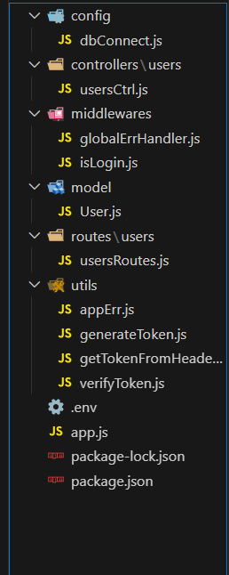

# create-server-side-app

`create-server-side-app` is a command-line tool that helps you quickly set up a backend application with a pre-defined structure and configuration. This tool is designed to streamline the process of creating server-side applications, allowing you to focus on building your features instead of setting up the project structure.

## Features

- **Easy Setup**: Quickly create a new backend application with a simple command.
- **MVC Structure**: Automatically generates a project with the Model-View-Controller (MVC) architecture.
- **Customizable**: You can specify the name of your application or create it in the current directory.
- **Template Ready**: Uses a predefined template for backend setup.

## Installation

You can create a new backend application using `npx` without installing it globally:


**Step 1:**

with custom folder name
```bash
npx create-server-side-app [your-app-name]
```
[OR]

within current folder
```bash
npx create-server-side-app *
```
[OR]

with default folder name
```bash
npx create-server-side-app
```


**Step 2:**
```bash
npm install
```

**Step 3:**

- Add mongodb url into `.env` file.
- run the code:
```bash
npm run app.js
```

## Structure





